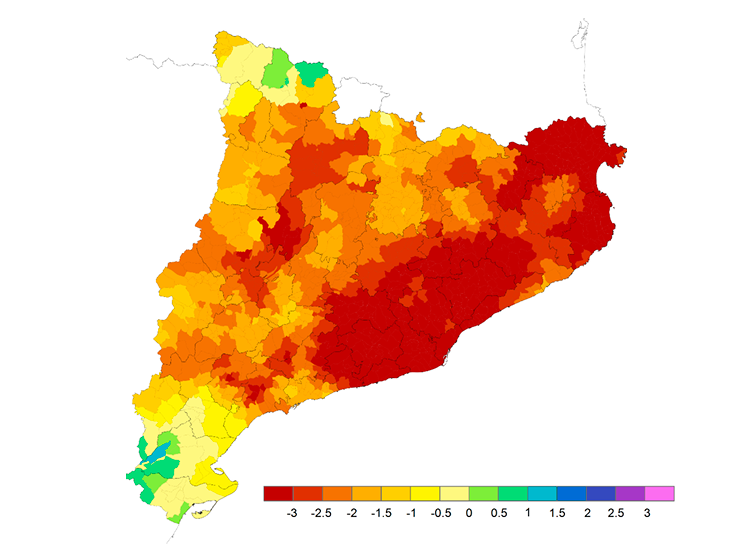
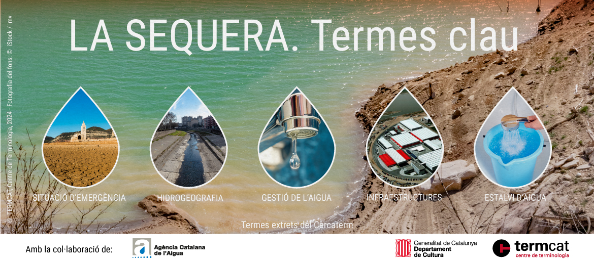
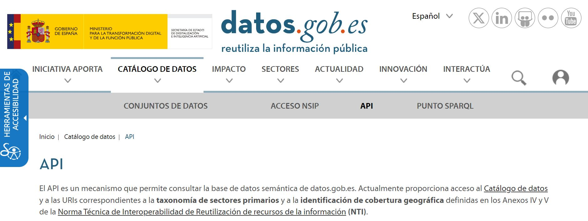
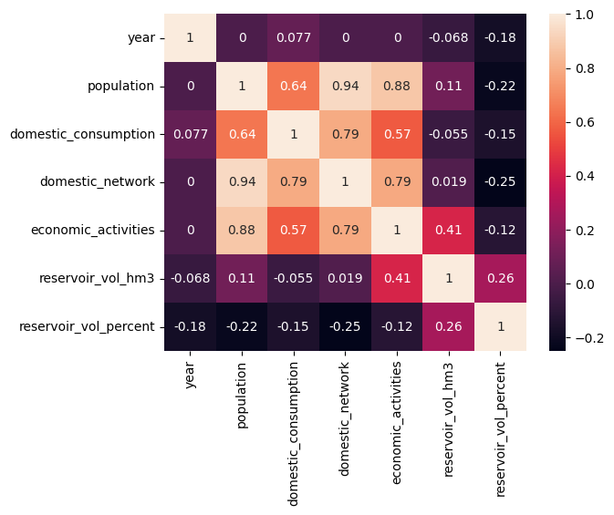
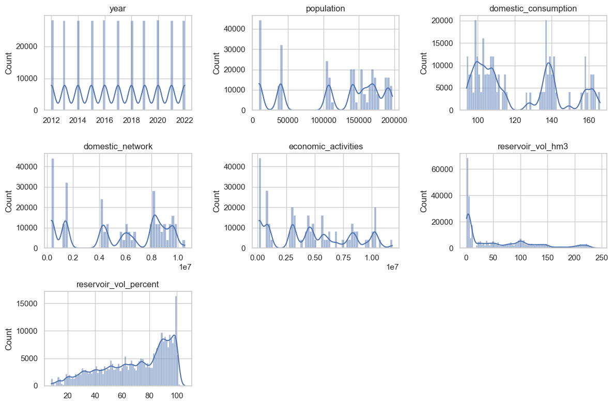
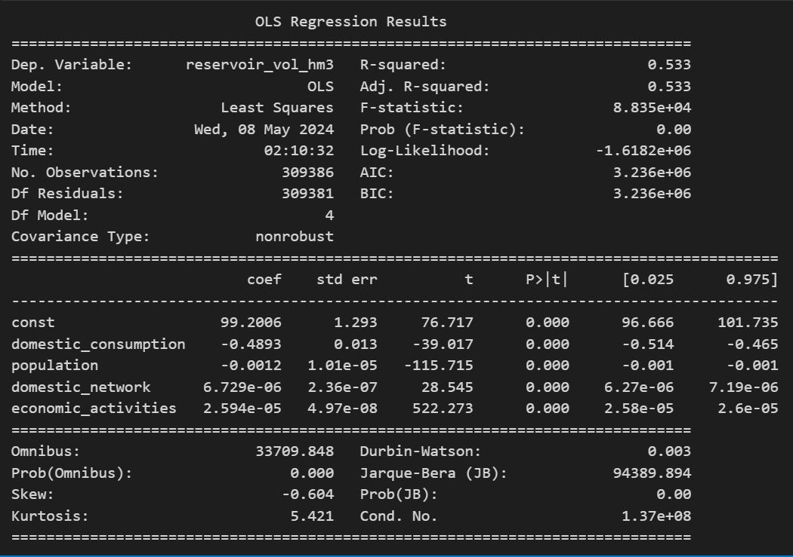
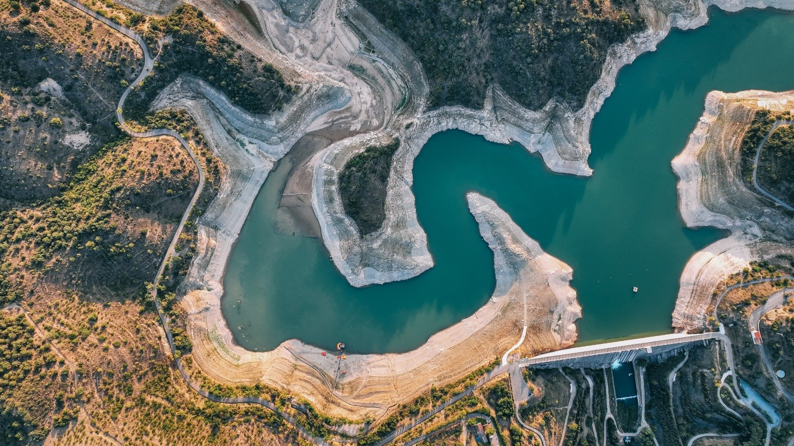

<h2 align="center">🌊Water Consumption Analysis in Catalonia🌊</h2> 
    

    

<i>Utilizing Government of Spain Open Data</i>

## Table of contents
- [Table of contents](#table-of-contents)
- [Introduction:](#introduction)
- [Initial objective: Understanding Water Consumption Dynamics](#initial-objective-understanding-water-consumption-dynamics)
- [Data Sources:](#data-sources)
- [Methodology:](#methodology)
- [Data Preparation: Cleaning, merging, and formatting the datasets for analysis](#data-preparation-cleaning-merging-and-formatting-the-datasets-for-analysis)
- [Exploratory Data Analysis: Visualization and exploration to identify patterns and correlations](#exploratory-data-analysis-visualization-and-exploration-to-identify-patterns-and-correlations)
- [Feature Engineering: Transforming and selecting features to improve model performance](#feature-engineering-transforming-and-selecting-features-to-improve-model-performance)
- [Preprocessing: Addressing data issues like multicollinearity and encoding categorical variables](#preprocessing-addressing-data-issues-like-multicollinearity-and-encoding-categorical-variables)
- [Linear Regression Modelling and results interpretation:](#linear-regression-modelling-and-results-interpretation)
 

## Introduction:

**The Significance of choocing this data is addressing Urgent Environmental Concerns**
The project's focus on water consumption analysis is particularly timely and critical in light of the declared Drought Emergency, aiming to contribute to efforts to mitigate the effects of water scarcity.

**Defining Drought** Drought is generally defined as “a deficiency of precipitation over an extended period of time (usually a season or more), resulting in a water shortage.”

    

        
    

## Initial objective: Understanding Water Consumption Dynamics
Investigate how water consumption varies across different regions in Catalonia, particularly in areas affected by the Drought Emergency.

1. Extracting and gathering related data via API or other open data sources 
2. Exoloratory Data Analysis
3. Feature Engineering (Transformation, Selection, Generation)
4. Preprocessing for Linear Regression (Including Target Feature Choice, Multicolineality analysis, Encoding, Scaling...)
5. Develop regression models to predict water consumption based on various factors, including domestic usage, economic activities, and municipal needs.

## Data Sources:

    

        
    

- The Primary dataset is gathered from public data from the Spanish Government API, detailing water consumption by region in Catalonia. The data is in a json format (dictionary like) so from there the metadata of the columns descriptions were found, and also from the arrays within arrays I the information necessary to create the main dataset was found and transformed
- As the primary dataset was quite small and the objective was to develop a linear regression, incorporating additional reservoir data to enrich the analysis, was the next objective. After looking some data about rainfall volumes in catalonia ,there was nothing fitting. Eventually I found a dataset containing informationon the state of reservoirs in the Internal Basins of Catalonia, sourced from the government of Spain's data portal.

## Methodology:
**Data Gathering** Retrieval of water consumption and reservoir data.

    

        
    

The data gathering which all the project developing and process depends, was the most time consuming and challenging part of the project. After trying about 3 different API sources for different data (for some of them a lot of permissions and tokens were needes, and some other were too confusing in order to retrieve the data) I found the Government of Spain open data to be very useful. At some point I considered change the whole project to conduct a Time Series Analysis project but at the very end I could retrive useful and significant data.

## Data Preparation: Cleaning, merging, and formatting the datasets for analysis
I started with a primary dataframe cleaning (water consumption df) and standarizing the columns. I took did a first look at a heatmap of the numerical values to chech how de data correlated.

    

        
    

When I realized I needed more data for a more robust analysis and I uploaded the reservoirs dataframe another challenging task started.

In order to merge correctly the two datasets I had many failed attempts…

After analizing all the errors I was getting and merging in different ways as trying aggregation techniques to calculate total water consumption by region and year from the first set of data. I tried  then grouping the second dataset by day, and then join  based on date to will allow us to see how water consumption varies with respect to the state of the reservoirs on a daily basis. But this resulted in a lot of mismatched other values so I created some functions to match reservoirs with regions, with region codes etc.. so I could have matching values in both datasets to relate and merge better.

Also I fixed some data types as datetimes, created two subsets with aggregations before merging.

So one of them had info about water consumption by region (yearly) and the other the state of water basins/reservoirs by day and region.

After the merged data I encountered more challenges I will adress.

## Exploratory Data Analysis: Visualization and exploration to identify patterns and correlations

    

        
    

At this point I cleaned and standarized the new complete merged data, and cheched correlations for numericals as the categorical data was not relevant for the future modelling.

## Feature Engineering: Transforming and selecting features to improve model performance
I plotted all the numerical values to see the distribution, there where no null values and no worrying outliers but.. Some of the variables had big gaps.

I checked for null values but there where none, also the different merging methods, for datatypes mismatches or different ranges but after inspecting there where some possible issues after the merging:

In some variables there is a lack of data density possibly be due to a lack of sampling or data collection in some intervals (as one df is yearly and other daily after merging-grouping, etc), also the nature of the data itself might have leaded to gaps in the plots with some variables with the data highly negatively skewed. 

**So I  processed the variables with:**

Square roots, logarithms, normalizing data and scaling with MixMax scaling so everything its within the same range (to follow normal distribution).

But I could not get a big improvement after trying to normalize the data so I decided to try to move forward to see what I could get.

    

        
    

## Preprocessing: Addressing data issues like multicollinearity and encoding categorical variables
Here I checked for multicollinearity, and as I didn’t need to encode categoricals I tried some train tests setting different possibilities as dependent and independent variables.

## Linear Regression Modelling and results interpretation:

Building regression models to predict water consumption or to predict reservoir volume (hm3) based on other variables in the data set.

 After conducting multiple tests, the most promising result I obtained was an R2 score of 0.5491878760201379. This score indicates that approximately 54.92% of the variability in the dependent variable is explained by the regression model. While this suggests that the model has a moderate ability to predict or explain the dependent variable, there remains a significant amount of variability unaccounted for.

 

    

        
    

In this analysis, the dependent variable was the volume of water in cubic hectometers stored in reservoirs, while the independent variables included domestic water consumption, population, domestic network capacity, and economic activities. Although some coefficients were negative, implying a potential inverse relationship, I hypothesize and think that the volume of water in reservoirs and water consumption may be indirectly related, serving as indicators of climatic conditions and also in a way indicator of the population water consumption habits.

While the results are not unsatisfactory, there is a lot of room for improving.

My take on this is that after all the tests if this is the best fitting one means that probably the data may have been merged in different ways or I could have conducted two separated linear regressions to predict one one hand water consumption with maybe much better results so this is a good ans valuable learning experience to understand the importance of understanding the source data, defining clear research questions, and implementing appropriate preprocessing techniques to enhance model performance. 

Also, it highlights the iterative nature of model building, emphasizing the need to adapt and refine approaches based on specific objectives rather than only focusing on achieving a predefined metric. Overcoming obstacles and frustrations throughout the process provided me valuable insights into the data, ultimately facilitating a deeper understanding and interpretation of the linear regression model results.

 

    

        
    

